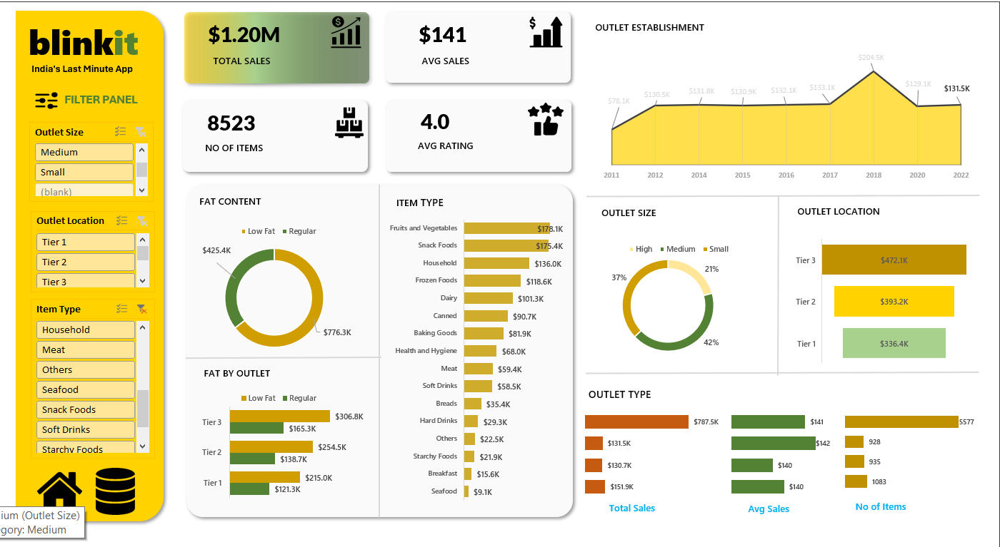

# 🛒 Blinkit Sales Analysis Dashboard (Microsoft Excel)

Transforming Retail Sales Data into Actionable Business Insights

---

# 📌 Project Background

Retail businesses generate thousands of sales transactions every day. Analyzing this data helps organizations understand customer purchasing behavior, product performance, outlet efficiency, and overall sales trends.

This project presents an interactive **Blinkit Sales Analysis Dashboard** built using Microsoft Excel. The dashboard converts raw sales data into meaningful visual insights that support business decision-making.

---

# 🎯 Project Objectives

- Analyze overall sales performance.
- Compare sales across outlet types and locations.
- Evaluate product category performance.
- Monitor customer ratings.
- Build an interactive dashboard for business analysis.

---

# 📊 Dashboard Highlights

- Total Sales
- Average Sales
- Average Rating
- Number of Items Sold
- Sales by Outlet Type
- Sales by Outlet Size
- Sales by Location Tier
- Item Type Analysis
- Fat Content Analysis
- Year-wise Outlet Establishment
- Interactive Filters (Slicers)

---

# 🛠 Tools & Skills Used

- Microsoft Excel
- Pivot Tables
- Pivot Charts
- Slicers
- Conditional Formatting
- Data Cleaning
- Dashboard Design
- KPI Cards

---

# 📈 Key Business Insights

- Identified top-performing outlet types.
- Compared sales across different location tiers.
- Analyzed product category contribution to total sales.
- Evaluated customer ratings and purchasing trends.
- Visualized outlet performance using interactive charts.
- Created KPI cards for quick business analysis.

---

# 💼 Business Value

This dashboard helps businesses to:

- Track overall sales performance.
- Identify high-performing products.
- Compare outlet performance.
- Understand customer buying patterns.
- Support data-driven business decisions.

---

# 📂 Project Files

- Blinkit Grocery Data Excel.xlsx
- blinkit.png
- README.md

---

# 👨‍💻 Author

**Poorna Chandra**

Aspiring Data Analyst

📧 Open to Data Analyst Internship & Full-Time Opportunities
